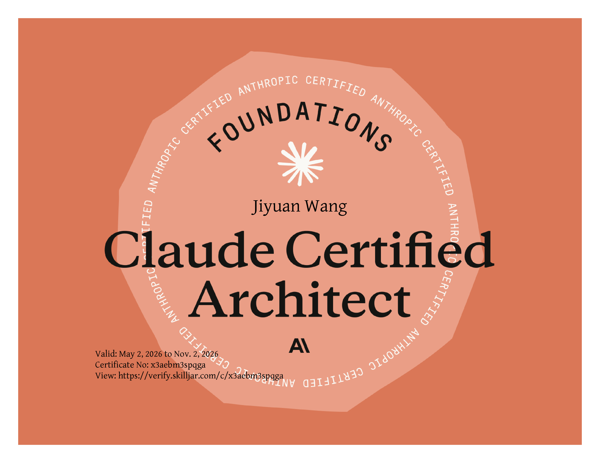

# 👋 Hi, I'm Johnny Wang

🎓 **Computer Science Student** @ York University, Toronto
🤖 Passionate about **AI Agent Systems** and **Java Full-Stack Development**, currently preparing for my **2026 Co-op placement**.
🌱 Building intelligent applications powered by **LLMs, multi-agent orchestration, and RAG pipelines**.

---

### 🚀 Tech Stack

💡 **Languages:** Java, TypeScript, JavaScript, SQL, C
🧰 **Frameworks & Libraries:** Spring Boot 3, Spring AI, React 19, Next.js 14, Vue.js 3, Tailwind CSS, MyBatis
🗄️ **Database:** MySQL, PostgreSQL, H2
⚙️ **Tools:** Git, Docker, Maven, Postman, IntelliJ IDEA, VS Code
🤖 **AI & Agents:** Claude API (Anthropic), OpenAI API, Gemini API, SiliconFlow, OpenRouter, RAG, Tool Calling, MCP

---

### 🧠 AI Agent Capabilities

| Capability | Description |
|------------|-------------|
| **RAG Pipelines** | Retrieval-Augmented Generation with vector search for context-aware AI responses |
| **Tool Calling** | LLM function-calling to invoke APIs, query databases, and trigger backend actions |
| **Multi-Agent Orchestration** | Coordinating specialized agents via Spring AI for complex task decomposition |
| **Prompt Engineering** | Structured prompting with system roles, few-shot examples, and chain-of-thought |
| **Streaming Responses** | Real-time SSE token streaming for responsive chat UIs |
| **AI Model Integration** | Experience with Claude, GPT-4, Gemini, DeepSeek across multiple providers |

---

### 🧱 Featured Projects

| Project | Description | Tech Stack |
|----------|--------------|-------------|
| [✨ Aura Quiet Living](https://github.com/johnnywang-byte/aura-quiet-living) | A production-ready **e-commerce platform** powered by **Spring AI Agents**. Features an intelligent customer service agent with **RAG**, tool calling for order management, role-based access, and a modern React frontend. | Spring AI, Spring Boot, React 19, TypeScript, MySQL, OpenAI |
| [🧠 Knowledge Base (Lightweight RAG)](https://github.com/johnnywang-byte/Knowledge-Base-lightweight-) | A **lightweight RAG knowledge base demo** with FastAPI + Streamlit + ChromaDB + FastEmbed. Features semantic search, streaming Q&A with graceful fallback, and a framework-agnostic **Agent Skill** module. No GPU required. | FastAPI, Streamlit, ChromaDB, FastEmbed, DeepSeek, Python |
| [💪 FitLogic](https://github.com/johnnywang-byte/Fit-Logic) | An **AI-driven fitness ecosystem** with a personalized workout plan generator and an interactive AI coach chat. Uses **DeepSeek-V3** via SiliconFlow with Spring AI. Features Google OAuth, email OTP, trainer marketplace, and gym buddy matching. | Spring Boot, Spring AI, Next.js 14, PostgreSQL, DeepSeek, Azure |
| [🎓 York Academic Portal (YAP)](https://github.com/johnnywang-byte/York-Academic-Portal) | A full-stack university management system featuring **AI-powered assistance (Gemini)**, role-based access control (RBAC), and data visualization. | Spring Boot, Vue.js 3, MySQL, Gemini API |
| [🪄 Gemini Magic Wand](https://github.com/johnnywang-byte/Gemini-Magic-Wand) | A productivity Chrome extension that upgrades raw inputs into **expert structured prompts** via Gemini API. Features 4 specialized modes and a glassmorphism UI. | JavaScript, Chrome Manifest V3, Gemini API |
| [🎮 Roco Kingdom CLI](https://github.com/johnnywang-byte/RocoKingdom) | A console-based RPG game built to practice **Object-Oriented Programming** and modular Java design. | Java, OOP |

---

### 🏅 Certifications

> **Claude Certified Architect** — Anthropic Foundations · Valid May 2026 – Nov 2026 · [Verify](https://verify.skilljar.com/c/x3aebm3spqga)

---

### 📊 GitHub Stats

---

### 🌱 Currently Learning

- **Agentic AI:** MCP (Model Context Protocol) and multi-agent workflows with Spring AI
- **LLM Internals:** Context window management, embeddings, and vector similarity search
- **Cloud Engineering:** Docker Containerization & CI/CD Pipelines on AWS EC2
- **System Design:** Scalable Architecture & Database Optimization

---

### 💬 Contact Me

📧 **Email:** jywang@my.yorku.ca
🔗 **LinkedIn:** [linkedin.com/in/johnny-wang-652820337](https://www.linkedin.com/in/johnny-wang-652820337)
📂 **Portfolio:** [github.com/johnnywang-byte](https://github.com/johnnywang-byte)

---

⭐️ *"Build agents that think, systems that scale."*
